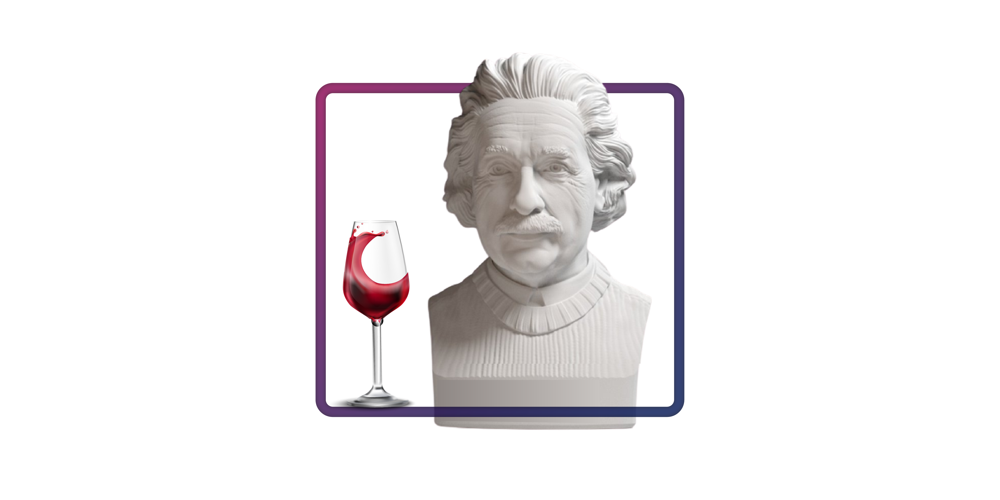

# Machine Learning - Wine Quality

## 👨🏻‍🏫 Description

Exploring a dataset of 🍷 **Red Wines** 🍷 from Potuguese's "Vinho Verde" type. The dataset indicates the **quality score** (0-10) given via sensorial to each wine.

## 🎯 Goal

Create two Machine Learning Models. One to **predict the quality score** and the other to **classify a wine to "good" or "bad"**.

**Premisses:**

- The Models to be used are from Linear and Logistic Regression.

**Access the notebook in ENGLISH [HERE](https://github.com/ewerthonk/ML-wine-quality/blob/main/1.0-ejk-eda-and-models-en.ipynb) to check the EDA, Models, and Discussion.**

**Access the notebook in PORTUGUESE [HERE](https://github.com/ewerthonk/ML-wine-quality/blob/main/1.0-ejk-eda-and-models-pt.ipynb) to check the EDA, Models, and Discussion.**

## 📰 Metadata

From the [link](https://archive.ics.uci.edu/ml/datasets/Wine+Quality) where the dataset was downloaded:

- The dataset contains real data, collected on Oct 2009.
- There should be **NO** null values.
- The variables **ARE NOT** balanced.
- There is a possibility of **Outliers**.

It is also suggested that not all the 11 variables are relevante. They are:

1. fixed acidity 
2. volatile acidity 
3. citric acid 
4. residual sugar 
5. chlorides 
6. free sulfur dioxide 
7. total sulfur dioxide 
8. density 
9. pH 
10. sulphates 
11. alcohol

The 12˚ variable is the target: "quality". This class presents a score from 0-10 to a wine quality.